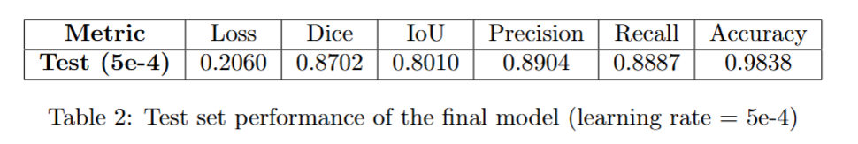
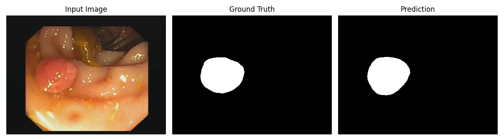
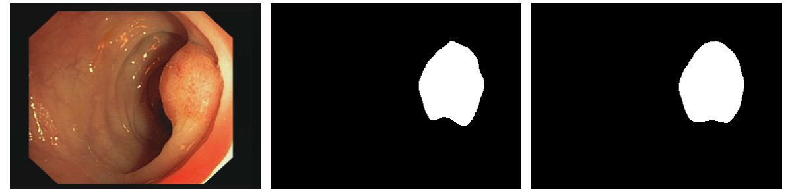
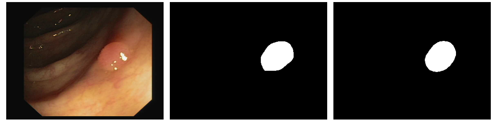

# Polyp-Segmentation
This project defines a binary semantic segmentation task using colonoscopy images and ground truth masks, aiming to improve model performance on classifying each pixel as polyp or background

- Download dataset from https://www.kaggle.com/datasets/balraj98/cvcclinicdb and run `setup.py` to split dataset into train/valid/test for hold-out validation. (I provided in `data/metadata` for reproducibility)  
- **NOTE**: If you just want to test the model, download the checkpoint from [here](https://drive.google.com/file/d/1bvz2WSxLjC37cq_vlq4GzmUmXcx8RHG_/view?usp=sharing).
- You can see short EDA on `eda.ipynb`.

## Getting Started
Create Virtual Environment and install all dependent packages (requirements can be found at `requirements.txt`):
```
# Step 1: Create and activate a new conda environment
conda create -n polyp-seg python=3.12 
conda activate polyp-seg

# Step 2: Install dependencies
pip install -r requirements.txt

# Optional: If you want to install Jupyter support
pip install ipykernel
python -m ipykernel install --user --name=polyp-seg
```


## Usage Example
Change hyperparameter settings and path on `config.yml` before running.
```
# train
python main.py \
    --config config.yml \
    --device 1 \
    --mode train

# test
python main.py \
    --config config.yml \
    --device 1 \
    --mode test \
    --ckpt_path ${MODEL_CKPT}
```

## Results

 

